# Skiers Destinations
      
[Visit the live **Skiers Destinations** here](https://carina-p.github.io/Skiers-Destinations/)

**Up-To-Date information about Ski Resorts** for downhill skiers who want 
**inspiration** for their next ski trip, **compare** different ski resorts or
just want **updated information** about **skiing conditions** and/or **weather
forecast** on a particular resort.

**Browser requirements** (at least version):|
---------------------------|
Chrome 58|
Edge 14|
Firefox 54|
Safari 10|
Opera 55| 
|
## Contents
- [UX](#ux)
  * [External users goal](#external-users-goal)
  * [Site owners goal](#site-owners-goal)
  * [User stories](#user-stories)
  * [User requirements and Expectations](#user-requirements-and-expectations)
    + [Requirements](#requirements)
    + [Expectations](#expectations)
  * [Wireframes](#wireframes)
  * [Major changes compared to above wireframes](#major-changes-compared-to-above-wireframes)
  * [Design Choices](#design-choices)
    + [Fonts](#fonts)
    + [Colors](#colors)
- [Features](#features)
  * [Responsive](#responsive)
  * [Interactive elements](#interactive-elements)
  * [Features left to Implement](#features-left-to-implement) 
- [Technologies Used](#technologies-used)
  * [Languages used](#languages-used)
  * [Frameworks, Libraries and Programs used](#frameworks--libraries-and-programs-used)
  * [API (Application Programming Interfaces) used](#api--application-programming-interfaces--used)
- [Testing](#testing)
  * [Manual testing](#manual-testing)
  * [Automated testing](#automated-testing)
  * [Test cases/Scenarios](#test-cases-scenarios)
  * [UX testing](#ux-testing)
  * [Validation with W3S](#validation-with-w3s)
  * [Validation with JSHint](#validation-with-jshint)
  * [Different browsers](#different-browsers)
  * [Some of the bugs](#some-of-the-bugs)
- [Deployment](#deployment)
  * [Deploying the site](#deploying-the-site)
  * [Forking the GitHub Repository](#forking-the-github-repository)
  * [Making a local clone](#making-a-local-clone)
- [Credits](#credits)
  * [Content](#content)
  * [Media](#media)
  * [Acknowledgements](#acknowledgements)

<small><i><a href='http://ecotrust-canada.github.io/markdown-toc/'>Table of contents generated with markdown-toc</a></i></small>

## UX 
### External users goal
- Based on a map **easily** find **information** and **up-to-date facts** about
the best **ski resorts in Europe**.
- Find **inspiration** were to go on ski holiday by **comparing differents ski
resorts** when it comes to:
    - up-to-date **information** and facts 
    - other users **rating of resorts**.
- See how **snow conditions develop** over time by using the site frequently.
- Find the **weather forecast** for a resort.  

### Site owners goal
To **share information** with other ski lovers, get inspired by their rating
of resorts and **get up-to-date information** about skiing conditions and weather
at favourite spots.
 
### User stories 
- US_001: As a user I want to be able to **navigate directly** to the map.
- US_002: As a user I want to be able to **navigate directly** to the rating
list.
- US_003: As a user I want to be able to **navigate directly** to contact form.
- US-004: As a user I want to be able to **get back easily to the top** of the
page.

 

- US-005: As a user I want to know **where good skiing places**, in Europe, are
situated in a **map**. In this way I know were in Europe the resort is situated.

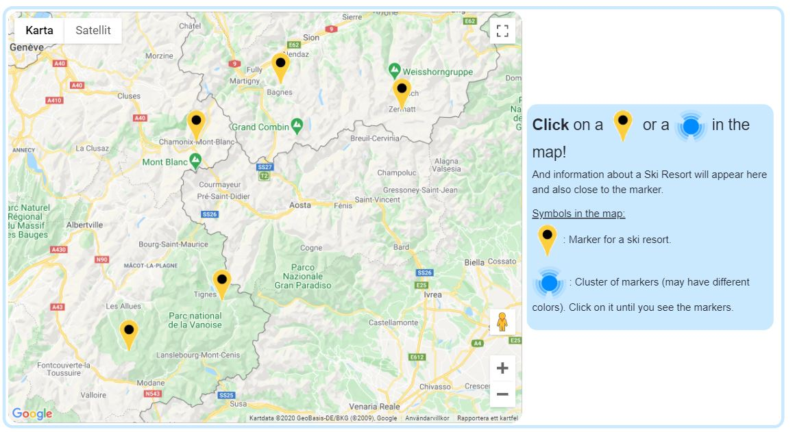

- US_006: As a user I want a **short description of a resort**. In this way I
can find out if I am more interested in a resort.
- US_007: As a user I want **up-to-date information** about **snow conditions**
at a resort. This is interesting to know if I am at the resort or on my way to
the resort. If I am not going to the place it is interesting to follow 
the development of snow conditions and/or compare to other resorts.
- US_008: As a user I want **todays weather forecast** at a resort.
This is interesting to know if I am at the place or on my way to the place and
want to know what to expect.

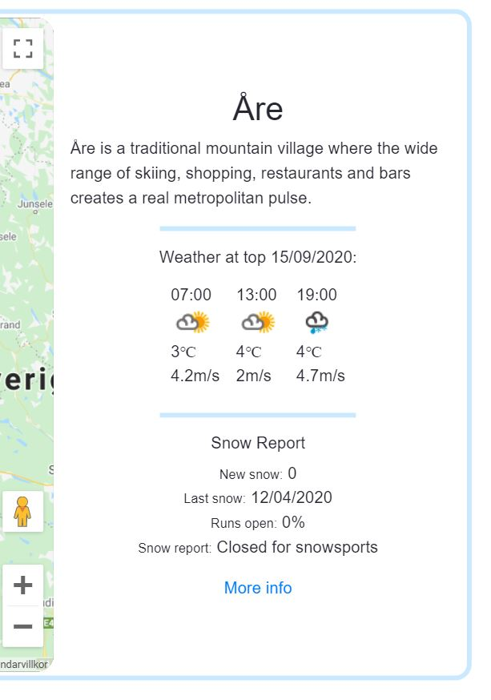 

- US_009: As a user I want to be able to **compare different ski resorts**.
Things to compare:
    - **altitude** at top and at base
    - number of **slopes**
    - number of **lifts**

    These things are interesting to know e.g. when you are deciding which
    resort you want to visit.

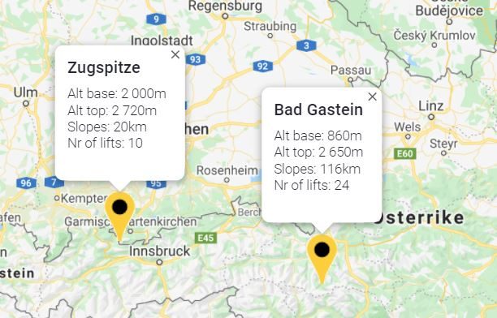

- US_010: As a user I want to know which skiing places **other users rank as
the best**. And I will get inspired which resort to go to and perhaps discover
a new resort I was not aware of. I can also compare a specific resorts ranking
to a resort that I already know about.

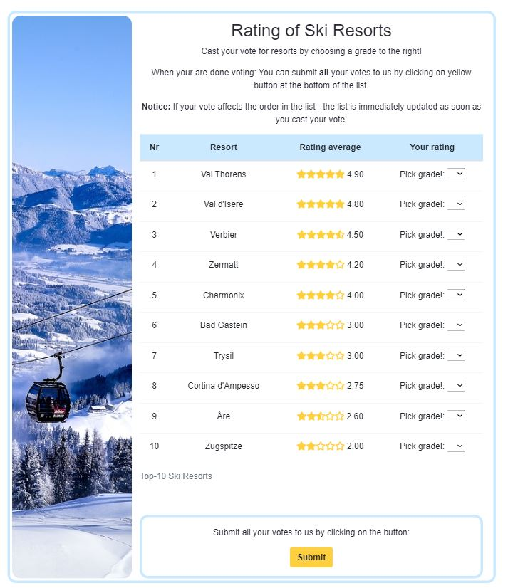
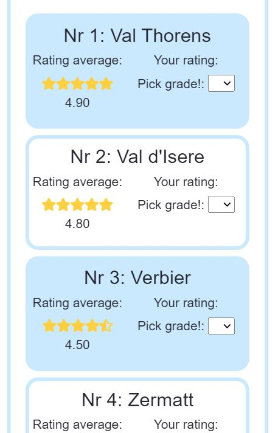

- US_011: As a user I want to be able to **cast my own vote** for a resort. And
thus contribute to other users descision processes.

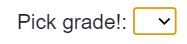

- US_012: As a user I want to be able to **see how I graded each resort**. Thus
I can compare my ranking between the resorts.
- US_013: As a user I want to see the **resulting top-list** after I have
casted my vote. If my vote affects the order of ski resorts, I want to see it
immediately. 

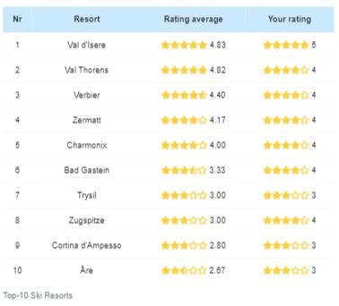

- US-014: As a user I want to be able to **submit my ratings** to be added to
the list.

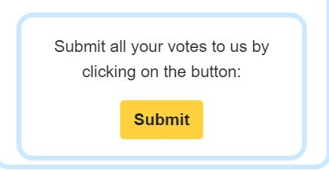

- US-015: As a user I want to be able to **influence which ski resorts are
shown** on the site. If I am interested in a particular ski resort that does
not show on the page. 

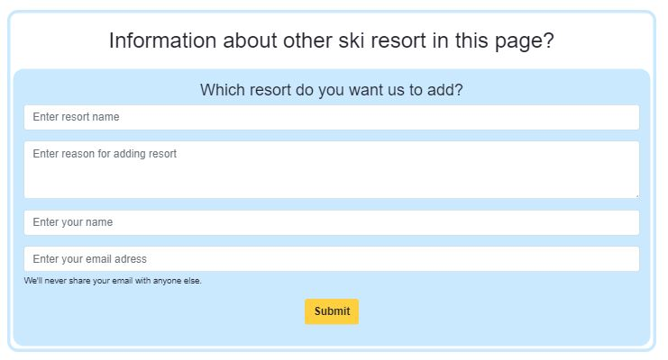

- US-016: As a user I want to be **inspired** to go skiing. And in this way
I will be more interested and keen on finding out more about resorts.

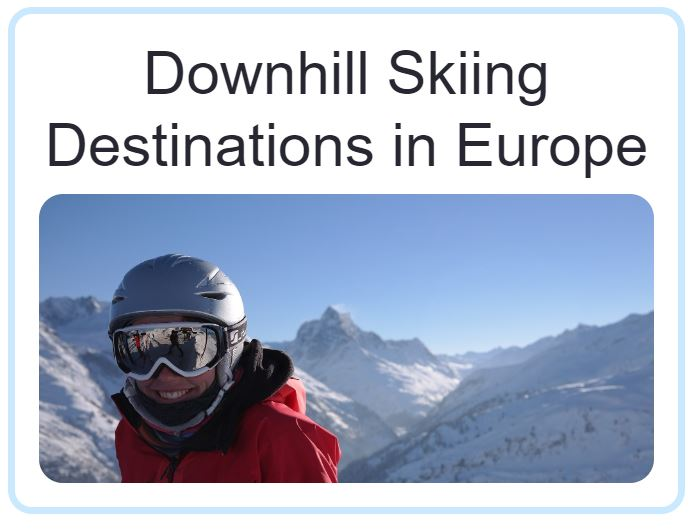

### User requirements and Expectations 
#### Requirements
- Navigate the website using **navbar**
- **Carousel with photos** in beginning of page to inspire users.
- **Markers** at ski resorts in the map.
- Beside marker: find **short facts** in InfoWindow about resort. Thus user is
able to **compare different resorts**.
- When user **choose a resort**: **information**, as forecast and snow
conditions, **for the resort** are shown close to the map.
- An **updated list** of the **10 most popular ski resorts** with name of the
place and its ranking. 
- **Overall average grading is calculated** from users input.
- **Grading is visualized** with the number of **stars** and if applicable
"half-star".
- The 10-top list should be **updated immediately** when user grade a resort.
- It is possible for same user to **cast more votes if reloading** the page.
- Possibility to **mail wish** for other Ski Resort to be shown on the site.
The input should include name of ski **resort**, why resort is interesting 
(**reason**), **name** of person who is mailing and persons **mail address**.

#### Expectations
- Content is **visually satisfying and informative**
- **Easily understandable navigation** taking user to the correct place
- **Links and buttons** work as espected
- **Responsive design** fitting on mobile, tablet and desktop 
- **Information** about a ski resort is immediately shown when user **has
selected a resort**.
- **Short information** in map stays open until user selects to close the
information.
- **Information beside/below the map** is **updated** every time the user
selects a new resort.
- **New average grade is correctly calculated** after user graded a ski resort.
- **Updating of 10-top-list** works after user grading.
- **Form validation** works correctly

### Wireframes
[Balsamiq Wireframes](https://balsamiq.com/) was used to build rudimentary 
wireframes for a basic understanding. Wireframes were made for **desktop,
tablet and mobile:**
- [Wireframe for Desktop](https://github.com/Carina-P/Skiers-Destinations/blob/master/wireframes/wireframe-desktop.pdf)
- [Wireframe for Tablet](https://github.com/Carina-P/Skiers-Destinations/blob/master/wireframes/wireframe-tablet.pdf)
- [Wireframe for Mobile](https://github.com/Carina-P/Skiers-Destinations/blob/master/wireframes/wireframe-mobile.pdf)
 
### Major changes compared to above wireframes
- Added a **carousel with pictures** in top of page to inspire user and attract
users.

### Design Choices 
- **Contents belonging** to one another are surrounded by a **blue border**.
- Younger user preferred the site to be **one page**: they did not want to many
clicks, rather scroll, on smaller devices as mobile phones.
- **Rounded edges** is a theme that gives a "softer impression".

#### Fonts
**Oswald** is chosen, because it is found **useful** on different 
platforms, **clean** and **easy** to read. "Oswald is designed 
to be used freely across the internet by web browsers on desktop computers, 
laptops and mobile devices." (quote from 
[Google fonts](https://fonts.google.com/specimen/Oswald#standard-styles). 

The **alternative** font is **Open Sans**. 
 
#### Colors
I want the colors to match a day in the skiing slope: White for **snow**, 
light-blue for the **sky** and yellow for the **sun**. 
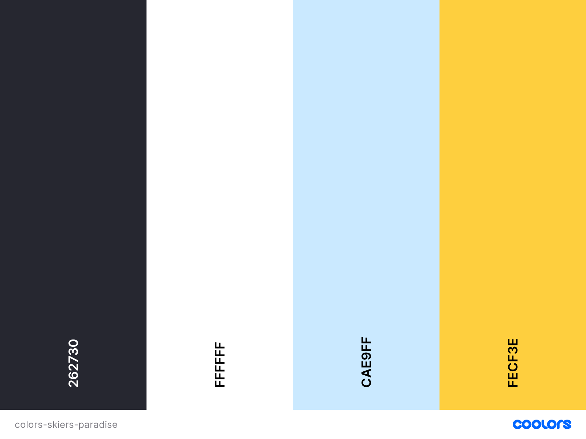

- **Text** to contrast lighter backgrounds: **Raisin black** #262730
- **Main background**: **White** #ffffff
- **Framing** as borders: **Columbia blue** #cae9ff
- Details to **stick out** as buttons: **Sunglow** #fecf3e

## Features
- **Header**:
    - navbar and logo fixed at the top of viewport:
        - **logo**: When hover over, it becomes larger
        - **navbar**: When hover over links, the font is bold

        
        
        - If smaller width of device links are collapsed to a "hamburger" menu.

        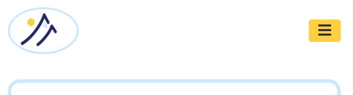

    - **Heading**: explanatory title
    - **Carousel** with inspiring photos of skiing and/or Alps
    
     
 
- **Map** with markers on popular skiing resorts.
 

- Ski resort information, shown in connection with the map, eg. "static
information as lat and long position", is for convenience, when adding more
resorts, saved in a file: 
[resorts.json](https://github.com/Carina-P/Skiers-Destinations/tree/master/assets/data).
Information is fetched from this file when page is loaded. 
- **Skiing-resort information** matching the resort user has **chosen in map**:
    - **Short information** about resort, as altitudes, slopes and pists,
    **in InfoWindow** beside resorts marker. This information stays
    on screen as long as a user does not close the window.

    
    
    - **More information**, as information about the resort, snow report,
    wheather forecast and a link to page with more information, are shown in
    a **larger information window**. This information is changed every time
    user clicks on other resort. On devices with larger width the information
    is shown beside the map. With smaller widths the information is shown below
    the map.

     

- **Table with top-10** skiing resorts, sorted with the **best ranked resort in
the top and the resort with lowest ranking in bottom**.
    - On devices with **larger width** the information is shown in a **table**
    
    
    
    - On **smaller devices** it is presented as **"cards"** that also are
    sorted in ranking order.

    
    
    - Ranking is **visualized with stars**:
        - The rankings integer is represented by full stars
        - If remainder is 0.75 or greater another full star is added
        - If remainder is between 0.25 and 0.75 a halv-star is added
        - The rest is represented by "empty stars" adding upp to 5

    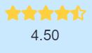
    
    - Possibility for user to do his/her **own ranking of a place**. When user
    has voted, the list is interactively sorted and updated on the page.
    
    
    
    - Possibility for user to **submit his/her votes** to be added to the
    list: 
 
     

        - **Modal** that informs how the submitting went.

        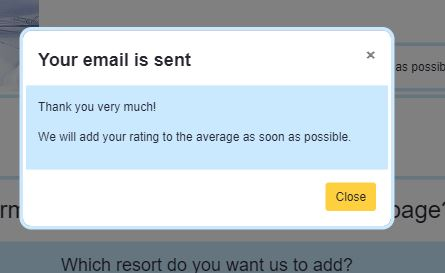

- **File with javaScript** for implementing the **rating list-section** of
page: assets/js/rating.js - The code is stored in **separate file** to make
it easier to find specific parts of the code and easier to add new code in the
future. The rest of the JavaScript code is stored in assets/js/scripts.js.
A negative effect is that the loading takes a little **longer** with two
javascript-files compared to **loading** one file.
- **Input-form to suggest** new ski resorts on the site.
    - Input fields: 
        - **Name of resort** user wish to add - mandatory
        - The **reason** user wants to highlight to get resort added - 
        voluntary
        - **Name of person** sending in wish - mandatory
        - **Email address** to person - mandatory and must contain an "@".
    - **Submit button**: when clicked, the information of the form is sent by
    email.
        - When hover over the button: background is changed to black and font
        to yellow
        - **Modal**: informing user if sending went well or not. (implementation
        looking very similar to modal after submitting votes)

- **Footer** with email contact information and social media:
    - **Email address** to get in touch with site owners
    - **Social media links** as facebook, twitter, linkedIn, instagram and
    youtube.
    - When hover over social media links icons are larger and background color
    is changed to Columbia Blue.

### Responsive
The site is design to fit devices with screen width from **320px** and larger.
The following features are designed differently for different devices:
- **Navbar**: On screen widths **smaller** than 768px the navbar **collapses**
into "hamburger" menu.
- **Resort information beside or below map**: On **larger** screens with width
over 768px longer resort information is shown **to the right of the map**. On
**smaller** devices the information is shown **below the map**.
- **Rating list**: On devices with screen **smaller** than 768px every resort
with rating is shown in a **"card-layout"** ordered from highest ranked resort
to lowest. On **larger** screens the information is presented in a **table**.
- On **very small devices** (width less than 400px) the **font size is 14px**. 

### Interactive elements
- The **navbar and logo**: to move around in the page
- When **clicking on marker** for a resort in the map: Both short resort
information and longer resort information appears. The short information is
located in a **infoWindow in the map** and the longer information **besides
the map**(if larger screens) or **below map** (if smaller screens).
The **longer information changes** when user clicks on other marker. The
**shorter information stays** as long as the **user chooses**.
- User can **cast a vot**e and rate ski resort and then: 
    - The grade casted is **visualized as stars**.
    - A **new average grading** for the resort is **calculated**.
    - If the new average grading for resort affects the resorts place in
    rating list - the **rating list is immediately updated**.
- User can **submit** his/her **votes by mail** by clicking on button, for
later adding to average rating list.
- User can **submit a mail** to wish **adding of a ski resort** to the page.

### Features left to Implement
Adding a **server**:
- to **store** the **rating** information in order for the user not having to
email the votes. Instead the **updating is done instantly to server** as soon
as user cast a vote.
- to **store and fetch** the resorts in the map from 
  
## Technologies Used 
### Languages used
- [HTML](https://developer.mozilla.org/en-US/docs/Web/HTML) 
    - The perfect language to build a static site.
- [CSS](https://developer.mozilla.org/en-US/docs/Web/CSS) 
    - For styling the site
- [JavaScript](https://www.javascript.com/)
    - Bringing interactivity to the site.

### Frameworks, Libraries and Programs used
- [GitPod](https://gitpod.io/)
    - Git was used for version control by utilizing the GitPod terminal to
    commit to Git and push to GitHub.
- [GitHub](https://github.com)
    - GitHub is used to store the code.
- [Bootstrap](https://getbootstrap.com/)
    - A helpful HTML, CSS (and JS) library that is great for responsive design.
- [JQuery](https://jquery.com/)
    - The project uses **JQuery** to simplify DOM manipulation.
- [JSON](https://www.json.org/json-en.html)
    - A data-interchange format used when retrieve information from other 
    sources as [Weather Unlocked](http://www.weatherunlocked.com/)
- [Fetch API](https://developer.mozilla.org/en-US/docs/Web/API/Fetch_API)
    - Fetch API provides an interface for fetching resources. In this project
    it is used for fetching data across the network from API sources but also
    to fetch from data file in this repository.
- [Jasmine](https://jasmine.github.io/)
    - Supports behavior-driven development, makes it easy to build unit test. 
- [Font-Awesome](https://fontawesome.com/icons?d=gallery)
    - From this library I picked the icons 
- [Google fonts](https://fonts.google.com/)
    - For inspiration and fonts
- [Balsamiq Wireframes](https://balsamiq.com/)
    - For designing the wireframes
- [Coolors](https://balsamiq.com/)
    - To generate color-schemes
- [Emailjs](https://www.emailjs.com/)
    - Used for sending email from "Add ski resort"-section

### API (Application Programming Interfaces) used
- [Google Maps Platform](https://developers.google.com/maps/documentation)
    - Provides the map and possibility to create markers and cluster of
    markers.
- [Wheater Unlocked](http://www.weatherunlocked.com/)
    - From this API up-to-date snow report and weather forecast for each resort
    is received.

## Testing
The testing has **mainly** been conducted **manually**. **Some automated
testing** was also developed. 

The TDD, **TestDriven Development**, process was followed. The development/
implementation **cycles** have been **very short** and **test cases** have
been developed/thought off, **before code** was implemented. 28 test cases are
documented here:
**[Test cases](https://github.com/Carina-P/Skiers-Destinations/tree/master/testing/test-cases/test-cases.pdf).**

**Before** new code was **commited**, testing of all code developed earlier was
**tested again**. And of course the **automated tests** were run 
**repeatedly**.

When **all features were implemented** and tested the following tests were 
performed:
- Went througt the **test cases**, for **functional testing and testing of
responsiveness**, as described below
- **HTML-code validated** by 
[W3S Markup validation service](https://validator.w3.org/)
- **CSS-cod validated** by 
[W3S CSS validation service](https://jigsaw.w3.org/css-validator/)
- **JavaScript-code validated** by [JSHint](https://jshint.com/)
- The site was tested on **different browsers**, as described below
- The **deployed version** was tested

### Manual testing
The manually testing was performed **regularly** in an **iterative** manner
adding a small part of code every time. Then **thorough** after all features
were in place. 

### Automated testing
The tests were developed ahead of implementing features. And obviously the 
**first tests failed all the time**. Then features are implemented and
automatically tested in an **iterative process** with small parts of code every
time.

The following automated tests have been developed:
- The **calculation of new average rating** when user casts av vote. The
function
is called calculateNewRating and belongs to the object: RatedResort.
- Test that function **hasVoted**, belonging to Object: RatedResort, returns
right value.
- Automated testing have been used on following functions to test what happens
if they are **given wrong conditions** as eg. something is wrong with input 
parameters (this was hard to test manually). The functions all belong to the 
object: RatedResort:
    - starsToHTML
    - rowToHTML
    - noVoteHTML

**To run tests:**
- Follow this link 
[Spec Runner](https://github.com/Carina-P/Skiers-Destinations/blob/master/testing/spec-runner.html)
- Start GitPod: Click on green button "GitPod"
- Open "Preview to the Side" in GitPod (icon in top right corner)  

### Test cases/Scenarios
28 test cases with protocol for functional testing and test of responsiveness
is documented here:
[Test cases](https://github.com/Carina-P/Skiers-Destinations/tree/master/testing/test-cases/test-cases.pdf)
Test of responsiveness was mainly performed with help of Chrome Developers Tool
on a large scrren. But also with iPad mini and iPhone8.

### UX testing
UX testing was conducted by **watching and interviewing users** when they used
the page. Examples of issues/discussions:
- Wish for a **heading above map** with resorts. (fixed)
- User could **submit/mail votes** when **no votes** where **casted**. (fixed)
- Discussed if user should be able to **submit rating list several times**
instead of once. Decided that it is enough with once.
- On **smaller** viewport widths, initial instruction is presented **under the
map** (in larger viewports to the right).
    - Discussed with users if should **move** the initial instruction and also
    the longer information about resort **to above the map** instead.
    - Users wanted **longer information below map**. They wanted to see the map
    first.
    - The solution was to **add a shorter version of user instruction above 
    map** for smaller screens.
- Sometimes **confusing** that the list is **updated as soon as user cast a
vote**. Especially if the resort moves up or down in rating list:
    - Users still **wanted the list to be updated at once**.
    - Did a trial where the "href was moved" to top of list after every time
    user casted a vote. The users thought it was better without this feature.
    - The solution was to **add a "notice" above list**.
 
### Validation with W3S
- **HTML**: Validated with **no errors** or warnings.
- **CSS**: Validated with **no errors** or warnings.

### Validation with JSHint 
**JavaScript** validated with **no errors**. 
- There are **four undefined variables**: google, $, MarkerClusterer and
emailjs: These are all **global variables** from sources that are **linked to
the site**.
- There are **two unused variables**:
    - clusterOfMarkers: used when call to a **constructor** from googles API.
    Must call constructor of MarkerClusterer to get cluster of markers in map.
    -  initMap is a **callback-function** initiated from the HTML code.

### Different browsers
The code is **mainly tested with Chrome**. But also **Firefox and Safari**.
- According to [W3 Schools](https://www.w3schools.com/js/js_es6.asp) the 
JavaScript code will probably not work well on browsers less than the 
following versions: **Chrome 58, Edge 14, Firefox 54, Safari 10 and Opera 55**. 
That are because following features from **ECMAScriptS6** is used: 
- let
- const
- template literal syntax
- arrow function

### Some of the bugs
**Example of solved bugs:**
- Problem with **synchronously** creating clusters and markers, in the map,
using information that needs to be **asynchronously fetched** first. 
For each resort fetched asynchronously both snowreport information and then
weather forecast must be fetched asynchronously from different resourses. And 
it is important to know that each fetch is done before next one starts.
This was solved by using fetch.then and Promise.all. 
- To be able to **calculate average rating** the **number of persons** that
have voted has to be known.
- User **could submit/email ratings** when **no votes** were casted.
- Placeholder of textarea in "wish-resort"-form did not show. It was due to
spaces and linebreak between end of closing tag for textarea> and beginning of
closing tag for </textarea.
Found solution at 
[Stackoverflow](https://stackoverflow.com/questions/10186913/html5-textarea-placeholder-not-appearing).

**Remaining "bugs":**
- Sometimes a **CORS**, Cross Origin Resource Sharing,-problem appears when
**fetching information from API: Weather Unlocked**. The problem happens
randomly to different resorts. When the problem occurs, the **user is
informed** which information that could not be fetched.

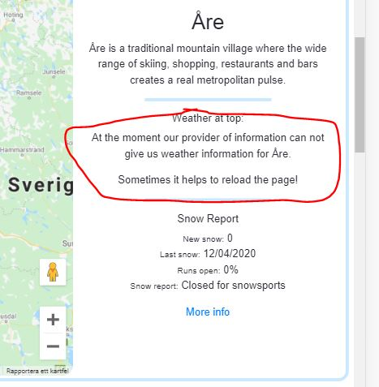

- Files under assets/images/weather/ have capital letters. These files are
copied from [Weather Unlocked](http://www.weatherunlocked.com/) and the files 
are referred to in **forecast information** fetched from Weather Unlockeds API.
The file names are not changed since information fetched referres to them with
the capital letters.
- The site has **issues with cookies** in cross-site requests, since SamSite
attribute is not set.

## Deployment 
Skiers Destinations was developed on **GitPod** 
[GitPod](https://www.gitpod.io/), using **git** and **GitHub** to host the
repository. The code was pushed to GitHub Pages.
 
### Deploying the site
When deploying Skiers Destinations using GitHub Pages the following steps were
made:
* Opened up **[GitHub](https://github.com/** in the browser and signed in. 
* Navigated to 
[Skier Destinations repository](https://github.com/Carina-P/Skiers-Destinations)
* In the top navigation selected **'Settings'**.
* Scrolled down the Settings page until the **"GitHub Pages"** area was
located. 
* Under "Source", the dropdown showing **"None"** was selected and then
**'Master Branch'** was chosen.
* The selection was saved and the page automatically refreshened. And the
published site is found by **scrolling back down the "Settings" again** to
"GitHub Pages". Where it says **"Your site is published at.."**

Here is the live site: 
[Skiers Destinations](https://carina-p.github.io/Skiers-Destinations/) 

### Forking the GitHub Repository
A copy of the GitHub repository is made by forking the account. The copy can
then be viewed and changed without affecting the original code. Forking is done
by:
* Log in to **GitHub** and locate 
**[Skiers Destination Repository](https://github.com/Carina-P/Skiers-Destinations)**
* At top right above the "Settings button" find **"Fork button"**
* **Click** on the "Fork" to **create a copy** in your own account.

### Making a local clone
* Log in to **GitHub** and locate 
**[Skiers Destination Repository](https://github.com/Carina-P/Skiers-Destinations)**
* Under repository name, locate **"Code"** and click on it.
* To the top right: locate green button called **"Code"** and click on the
button. 
* There are some choices:
    * Checkout with **SVN using web URL**: 
        * Copy the **url** shown or copy this: 
        https://github.com/Carina-P/Skiers-Destinations.git 
        * Use the url to import the code into your favourite **IDE**. Note that
        different Code Editors have different processes for making the clone. 
    * Using **GitHub Desktop**:
        * Save the clone directly by chosing **"Open with GitHub Desktop"**
    * Downloading **zip file**:
        * Select **"Download ZIP"** and all the files will be saved, zipped, to
        local computer. 
## Credits 
### Content 
- The information about altitudes, nr of pists and slopes was received from [Skiresort.info](https://www.skiresort.info/)

### Media
The photos used in this site were obtained from:
- [Can Stock](https://www.canstockphoto.se): used to make a logo
- [Pixabay](https://pixabay.com/): pictures in carousel and beside 
rating table on devices with medium and larger viewports
- [Google Maps Platform](https://developers.google.com/maps/documentation/javascript/marker-clustering):
The pictures of marker clusterer: 
- [Icons DB](https://www.iconsdb.com/): The yellow map marker: 

### Acknowledgements
I received inspiration for this project from: 
- Above all: [w3.schools.com](https://www.w3schools.com/)
- [dcode: How to use JSDoc -Basics & Introduction](https://www.youtube.com/watch?v=Nqv6UkTROak)
- [Web Dev Simplified: Learn fetch API in 6 Minutes](https://www.youtube.com/watch?v=cuEtnrL9-H0)
- [Jake Archibald: Introduction to JavaScript Promises](https://web.dev/promises/) 
- [MDN web docs: Using Promises](https://developer.mozilla.org/en-US/docs/Web/JavaScript/Guide/Using_promises)
- [Stackoverflow: Which heading to use in modals](https://stackoverflow.com/questions/60504268/which-header-should-we-choose-for-modal-dialogs)

Thanks to my mentor [Simen Daehlien](https://www.github.com/eventyret) who
has given me many good tips as Fetch, Arrow Function and also above youtube
links.
